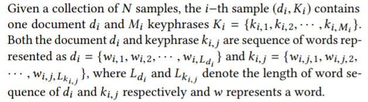
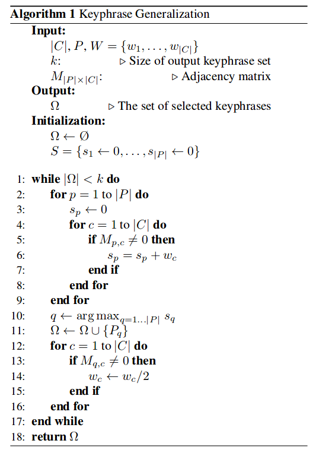
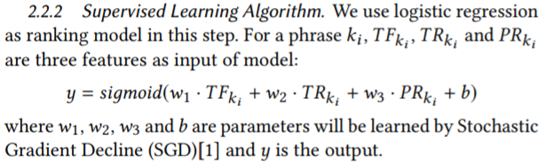
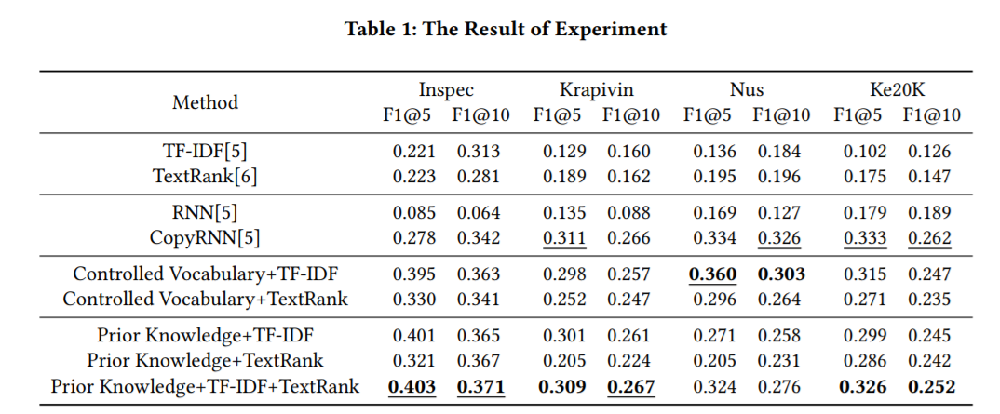

# Keyphrase Extraction Based on Prior Knowledge

> keyword和keyphrase是一回事，所以下文就都混着用了。

关键词提取分为两步：选出候选词(keyphrases candidate selection)和排名(keyphrases candidate ranking)。

对于模型而言，都是基于统计(TF-IDF, TextRank)或基于图的模型。

> 我认为“基于图的模型”指的是DNN,LSTM之类的。

传统的方法模型忽略了训练数据之外的外部知识。我们的贡献在于为现有的模型引入了先验知识(prior knowledge)，这些先验知识往往包含了被控制的关键词词汇表(controlled vocabulary of keyphrases)。所以，我们首先提取了controlled vocabulary of keyphrases and their prior probability作为先验知识，然后用监督学习算法去学习特征的最优权重。

> 我的问题：how to tokenize phrases and embed them？ 

vocabulary of keyphrases的提取：We collect existing keyphrases from document collections and get rid of duplicates to get controlled vocabulary represented as KV = {k1, k2, · · · , kO}

> 天雷滚滚，说了和没说一样，technical detail都不讲，已经预感到是大水文。

那么如何在一篇文章里挑出候选词呢？：Given a document di, candidate keyphrases are the largest match pattern of word sequence according to the controlled vocabulary of keyphrase.

接下来就是对候选词做rank：

### STEP 1：特征提取

TF-IDF (TF) + TextRank (TR) + Prior Probability (PP)

Prior Probability的定义如图，在此基础上对PPki进行标准化（pp-min/max-min）

### STEP 2: 通过逻辑回归训练三种特征提取的权重

# Result

训练集：Inspec, Krapivin, NUS and Ke20K
Metric：F1 score

Our methods achieve the new state-of-the art performance on Inspec in terms of both F1@5 and F1@10, Krapivin in terms of F1@10 and Nus in terms of F1@5. And the best results obtained from our methods are comparable with the state-of-the art model named Copy Recurrent Neural Network (CopyRNN)

> CopyRNN是我最初想follow的工作，是ACL 2017论文，Rui Meng, Sanqiang Zhao, Shuguang Han, Daqing He, Peter Brusilovsky, and Yu Chi. 2017. Deep Keyphrase Generation. In ACL 2017, Vancouver, Canada, July 30 August 4, Volume 1: Long Papers. 582–592.

