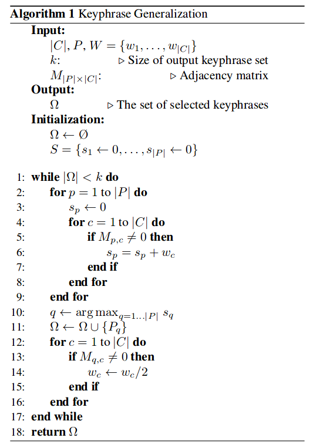

## Notes for WikiRank

WikiRank: Improving Keyphrase Extraction Based on Background Knowledge <https://arxiv.org/pdf/1803.09000.pdf>

### Main Contribution

1. Improve Topical PageRank to get good coverage of the main topics in the document.
2. Propose WikiRank, and model keyphrase extraction as an optimization problem, with solution+pruning method.

### Existing Problems

1. Overgeneration errors: AB frequent and topical, AC could also be regarded topical due to A's significance.
2. Redundancy errors: outputs a correct candidate and its semantically equivalent one. E.g. Machine learning and ML.
3. Infrequency errors: The keyphrase barely appears in the article. 

### Algorithm Details

1. Construct the semantic graph including concepts and candidate keyphrases
   1. How to connect plain text with human knowledge, or to say, how to find the concepts? TAGME
   2. How to do lexical unit selection(filter out unnecessray word tokens and generate a list of potential keywords)? Penn Treebank Tags: NN, NNS, NNP, NNPS, JJ. Stanford POS tagger.
   3. How to build the graph? Set P: candidate keyphrases; Set C: concepts; V: P $\cup$ C. If p contains concept c, edge (c, p) $\in$ E. 
   4. How to find the best candidate keyphrase set $\Omega$? Optimization problem: Find  $\Omega$ such that the sum of the scores of the concepts annotated from the phrases in $\Omega$ is maximized. Score of c can be written as $S(c)= \sum_{i=0}^{deg(c)} \frac{w_c}{2^i}$. Where $w_c$ is the weight of concept c, measured by its frequency. 
   5. How to do optimization? Algorithm pretty simple. 
2. (Optional) Prune the graph with heuristic to filter out candidates which are likely to be erroneous produced. Heuristics are listed below:
   1. Remove the candidate keyphrase $p$ from original graph $G$, if it is not connected to any concept.
   2. Remove $p$ from $G$, if it is only connected to one concept that only exists once in the document.
   3. For a concept $c$ connecting to more than $m$ candidate keyphrases, remove any candidate keyphrase $p \in Adj(c)$ which (1) Does not connect to any other concept. AND (2) The ranking is lower than $m$th among all candidate keyphrases conect to $c$. (In practice, $m$ often 3 or 4).

### Experiments

1. Datasets: DUC-2001, Inspec, NUS Keyphrase Corpus, ICSI Meeting Corpus.
2. Outperform whom? SingleRank, Topical PageRank.
