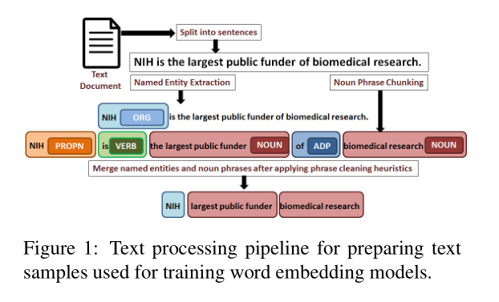
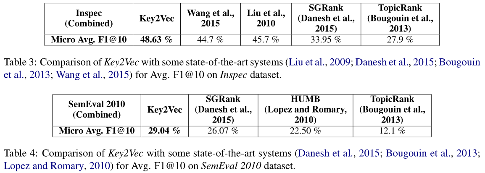
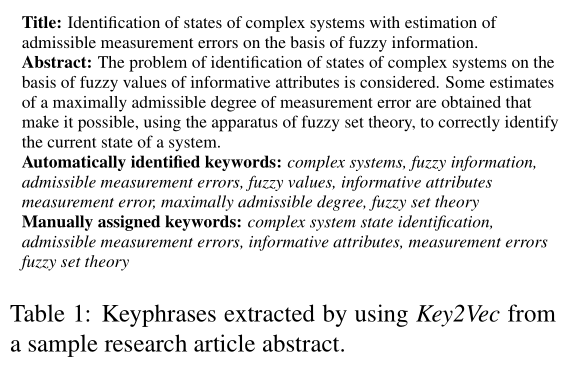

> 这篇文章在欧学长提供的资料中，是一种无监督学习的方法，收录在NAACL。
> 
> In the paper, we represent candidate keyphrases extracted from a scientific article by domain-specific phrase embeddings and rank them using a theme-weighted PageRank algorithm.
> 
> First preliminary attempt to use multi-word phrase embeddings for constructing thematic representation of a given document and to assign thematic weights to phrases have not been used for ranked keyphrase extraction.

# Method

### how to extract multi-gram phrases? (Text Processing)

we rely on trained dependency parsing(依存分析) and named entity extraction(命名实体提取) models. e.g. **Spacy**.

We take steps in cleaning the individual single word and multi-word tokens that we obtain. Specifically, we filter out the following tokens: (略)

We also take steps to clean leading and ending tokens of a multi-word noun phrase and named entity: (略)

Apart from relying on Spacy’s parser we use hand crafted regexes for cleaning the final list of tokens obtained after the above data cleaning steps: (略)

### Training Phrase Embedding Model

在方法上，作者将短语与单词一起训练，并不是传统的先训练词向量再通过加法得到短语向量。

We directly train multi-word phrase embeddings using **Fasttext**, rather than first training embedding models for unigram words and then combining their dense vectors to obtain vectors for multi-word phrases.

在模型上，作者认为Word2Vec不能做此类工作，因为它 only takes into account the semantic similarity between words based on their occurrences in a similar context and will not display the desired property that we want to leverage.

> Existing phrase embedding method:
> 
> Wenpeng Yin and Hinrich Schütze. 2014. An exploration of embeddings for generalized phrases. In ACL (Student Research Workshop). pages 41–47.
> 
> Mo Yu and Mark Dredze. 2015. Learning composition models for phrase embeddings. Transactions of the Association for Computational Linguistics 3:227–242.

---

# Candidate Selection

We split a **given document** into sentences and to extract noun phrases and named entities as described previously.

在candidate selection中，我们得到了候选词组 $C_{d_i} = \{c_1 ,c_2 ,...,c_n\}_{d_i}$

# Candidate Scoring

We extract a **theme excerpt** (主题摘抄) from a given document and further extract a unique set of **thematic phrases** comprising of named entities, noun phrases and unigram words from it. 

于是得到了 $T_{d_i} = \{t_1 ,t_2 ,...,t_m\}_{d_i}$

We get the vector representation  $\hat{t_j}$ of each thematic phrase extracted from the theme excerpt using the phrase embedding model, then assign a theme vector to a document: $\hat{\tau_{d_j}} = \sum_{j=1}^m \hat{t_j}$

The phrase embedding model is then used to get the vector representation ($\hat{c_k}$ , k from 1 to n)  for each candidate keyphrase in $C_{d_i}$.

> C & T的区别是？

# Candidate Ranking

To be continued......

# State-of-the-Art Performance

# Case Study

